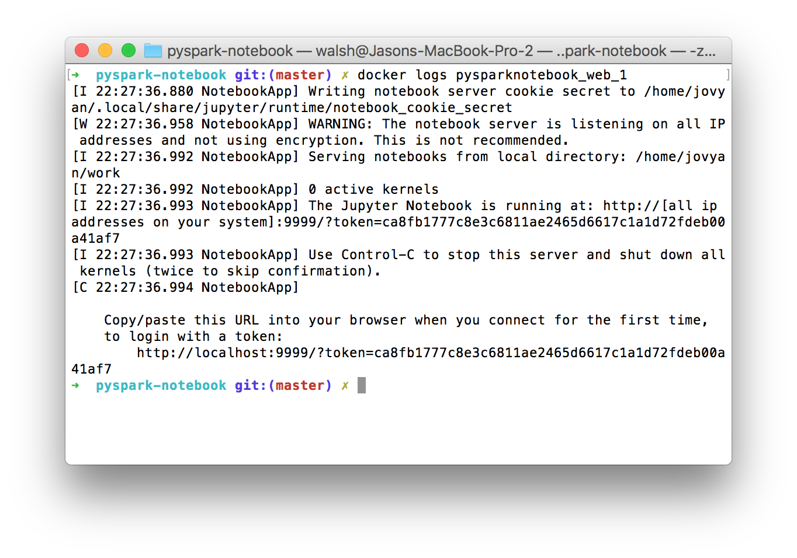

# Getting started

    $ git clone https://github.com/pennsignals/docker-stacks.git
    $ cd docker-stacks/pyspark-notebook
    $ docker-compose up -d

`-d` (detached mode): run containers in the background

# Notebooks

    $ docker logs pysparknotebook_web_1

Copy the generated URL and paste it into a web browser:

	

